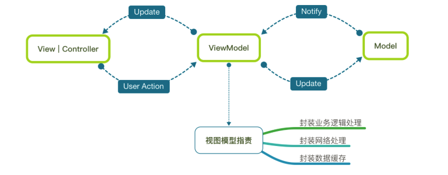

#iOS MVVM之ReactiveCocoa

## MVVM简介
开发中使用较为频繁的设计模式MVC


MVVM设计模式



## ReactiveCocoa(简称RAC)简介
RAC提供了一个单一的、统一的方法去处理异步的行为，包括delegate方法、blocks回调、target-action机制、notifications和KVO，是一个基于函数响应式编程思想（Funcation Reactive Programming，简称FRP）的框架
   


ReactiveCocoa层次结构如下图：


```
框架由几个重要组成部分：

* 1.信号：RACSignal，可以被订阅，订阅后可以进行逻辑处理或者数据传递
* 2.订阅者：RACSubscriber，用于订阅和发送数据，是一个协议，由具体的类实现
* 3.清理者：RACDisposable，用于取消或者清理订阅者的资源
* 4.RACSubject：可以当成一个信号，也可以充当信号发送者

```


## MVVM为什么要结合ReactiveCocoa
MVVM设计模式的关键是ViewModel，通过KVO、Block及NSNotification的方式同样可以实现，但是这种方式是有一定的局限性的，如Block满天飞、可扩展性不强

ReactiveCocoa充当View和ViewModel之间的Binder，优雅的实现了数据之间的数据绑定;给出了一种非常好的解决方案，它使用信号来代表这些异步事件，提供了一种统一的方式来处理所有异步的行为，包括代理方法、block 回调、target-action 机制、通知、KVO等


这些只是RAC的冰山一角，真正强大的地方是可以对以上不同的信号进行任意地组合和链式操作


####结合RAC的MVVM设计模式


## ReactiveCocoa导入
```
* 一般不直接使用 pod 'ReactiveCocoa'，会下载安装swift相关的库
* 安装使用 pod 'ReactiveObjC', :git => 'https://github.com/ReactiveCocoa/ReactiveObjC'

```


## 结论
```
* MVC固然古老，在小型项目中非常实用
* MVVM虽然很强大，有时候会增加一定的代码量
* 在实际开发中，不拘泥于某种架构，或者将二者结合使用，才是正确的做法
* RAC不会对现有代码构成侵略性，完全可以在一个单独的类中使用

```

## Demo


##参考文献
+[MVVM Tutorial with ReactiveCocoa](https://www.raywenderlich.com/2346-mvvm-tutorial-with-reactivecocoa-part-1-2)

+[什么是 MVVM 模式](https://www.jianshu.com/p/a898ef83f38c)

+[iOS MVVM之ReactiveCocoa](https://www.jianshu.com/p/763278ee047f)

+[iOS RAC使用介绍](https://www.jianshu.com/p/35a28cf0a22f)

+[ReactiveObjC部分使用介绍，原理及流程简介](https://www.jianshu.com/p/14075b5ec5ff)

+[MVVM With ReactiveCocoa](https://github.com/lizelu/MVVMWithReactiveCocoa)

+[ReactiveCocoa v2.5 源码解析之架构总览](http://blog.leichunfeng.com/blog/2015/12/25/reactivecocoa-v2-dot-5-yuan-ma-jie-xi-zhi-jia-gou-zong-lan/)

